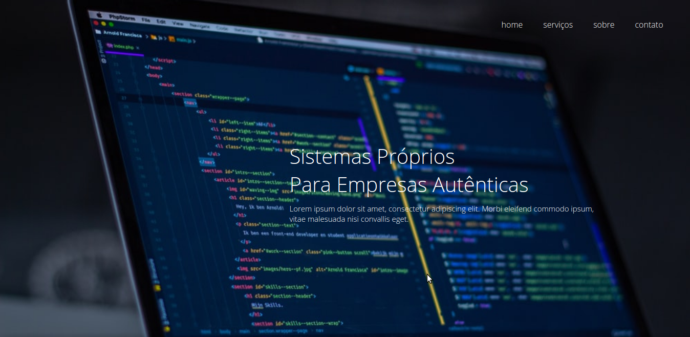
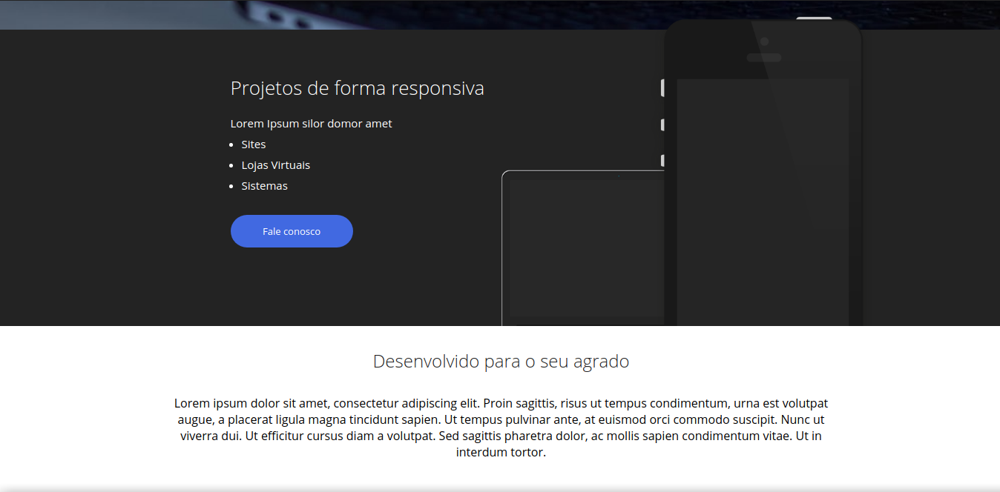
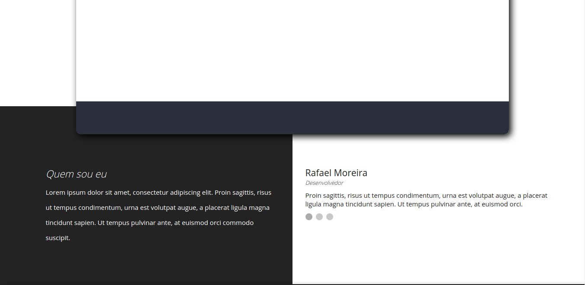
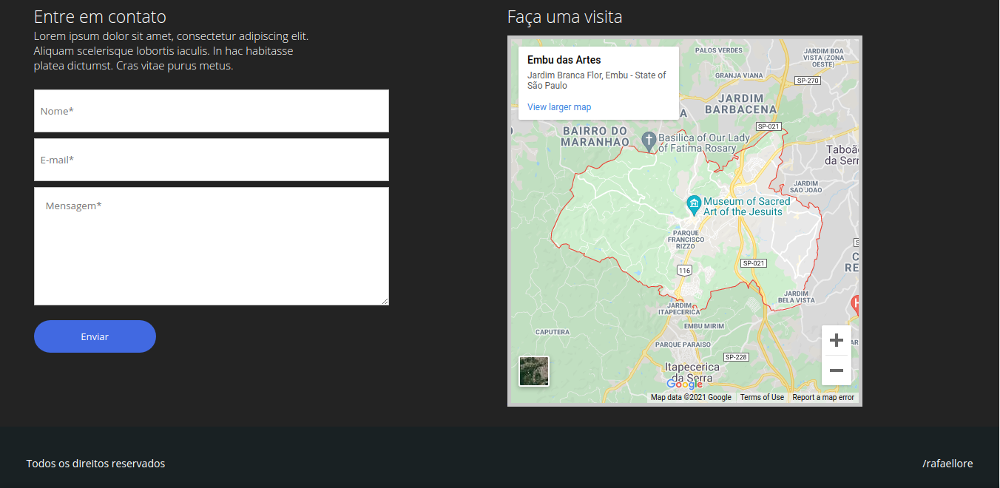
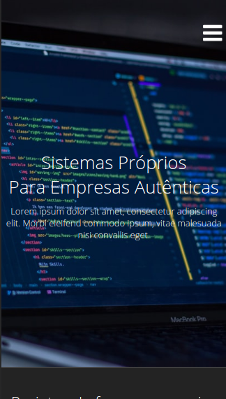
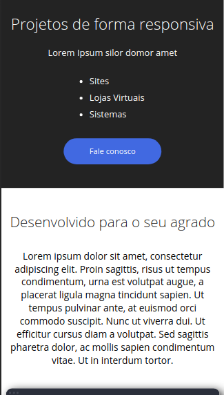
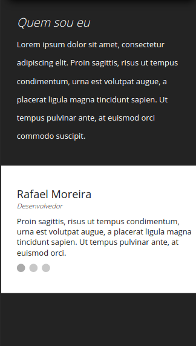
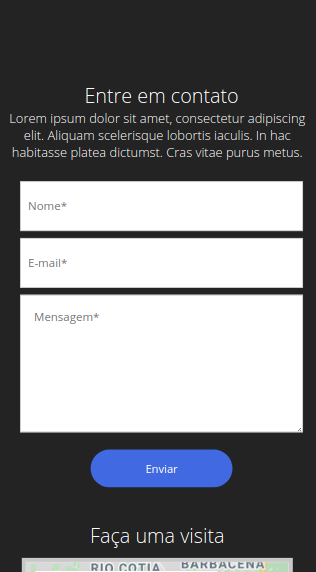
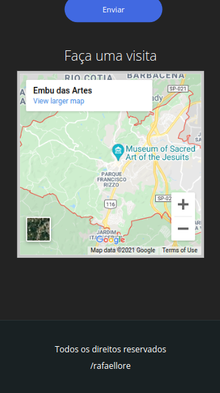

# Página responsiva para estudos de CSS3 :smiley:

Uma página totalmente responsiva feita para estudos voltados para a propriedade float do CSS. Utilizei HTML5 CSS3 e Javascript neste projeto.

## Imagens do projeto:

## Imagens do projeto em celulares:

## Clonar o projeto

Para clonar o projeto, basta usar o seguinte comando:

### `git clone` + o link desse repositorio

Você também pode fazer alterações como desejar! :smiley:
