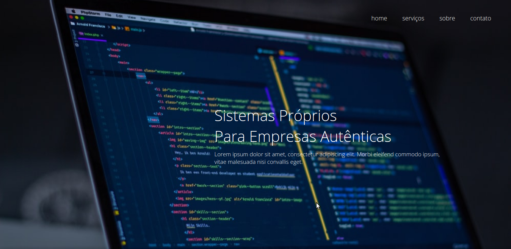
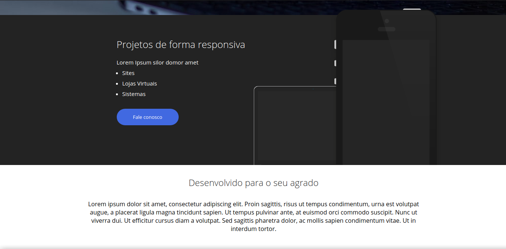
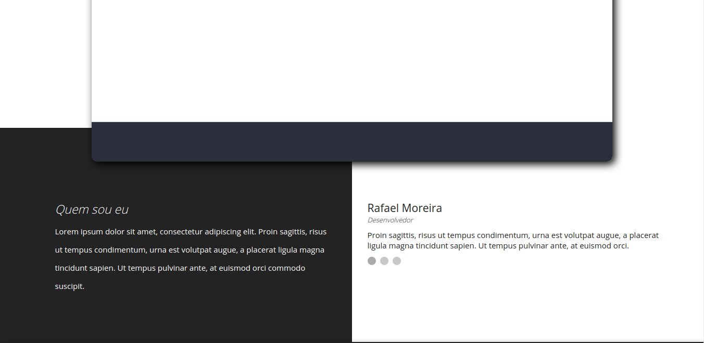
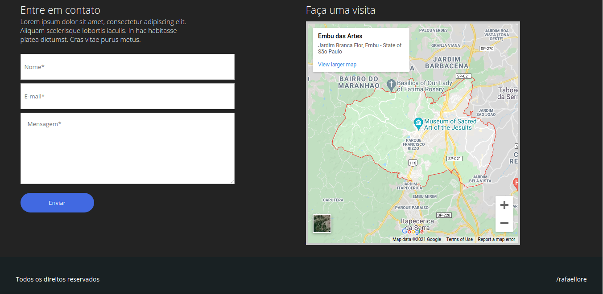

# Página responsiva para estudos de CSS3 :smiley:
Uma página totalmente responsiva feita para estudos voltados para a propriedade float do CSS. Utilizei HTML5 CSS3 e Javascript neste projeto.

## Imagens do projeto:

